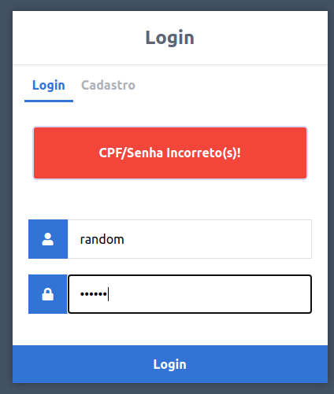
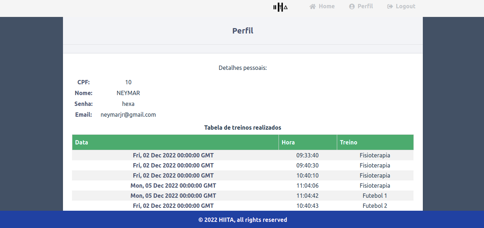

<p align="center">
  
</p>

# HIITA
Esse é um software desenvolvido na disciplina de CES28 do ITA para ajudar Treinadores Físico, Personais e Profissionais de educação física a preparar fichas de treinamento para seus Clientes Atletas. E para ajudar a visualização desse material para esses clientes Atletas.

Nessa disciplina não foi trabalhado a parte do Treinador, em disciplinas futuras é desejado acrescentar essa parte do projeto.

## Requirements
Python: 3.7
Libs principais: flask, flask-mysqldb
Database: MySQL Community Server (obrigatório) and MySQL Workbench (opcional)
Frontend: Npm, Vuejs

## Instalação:

### Banco de dados

Para instalação ver documentação do próprio [MySQL](https://dev.mysql.com/doc/mysql-installation-excerpt/5.7/en/) para sua OS. O MySQL server funcionará como Daemon e não precisará mais ser inicializado, somente sendo necessário a configuração da base de dados.

### Flask API Backend
Inicialmente vamos realizar a instalação seguindo o passo a passo com as bibliotecas necessárias de Python. A versão utilizada para o python foi a 3.7.11.

```
pip install requirements.txt
```

### Vue Front-end
Foi utilizada a tecnologia Vue para implementar o front-end da aplicação. Para isso devemos segue abaixo um passo a passo para instalação:

Para instalar NPM ver [documentação](https://docs.npmjs.com/downloading-and-installing-node-js-and-npm), a versão utilizada é a 8.1.4.

Uma vez instalada podemos instalar através do Node Package Manager(npm) a versão do vue desejada pelo terminal:

```
sudo npm install -g @vue/cli@4.5.11
```

## Setup Inicial

Todos os comandos aqui consideram o usuário na pasta raiz do projeto.

### Banco de dados
A geração do banco de dados inicial pode ser feita utilizando os arquivos disponibilizados na pasta database/dumpfiles:

- HIITA.sql: Base de dados inicial do projeto e caso queira criar a base de dados **hiita**
- hiita_mysql_dumpfile: Base de dados da apresentação final, onde assume que uma database importará o dump deste arquivo.

Para importar os bancos de dados utilize substituindo username por **root** caso seja sua instalação inicial do MySQL, ou por um usuário com acesso a modificações no MySQL. Além disso se desejar usar uma base já criada utilize hiita_mysql_dumpfile.sql e o nome da base existente, caso queira criar uma base hiita com as tabelas e dados, a segunda flag se torna opcional. E file naturalmeente são os arquivos que podem ser escolhidos anteriormente:

```
mysql -u [username] -p [database_name] < database/dumpfiles/[file.sql]
```

### Flask API Backend
No primeiro uso configurar no arquivo backend/API.py, os campos referentes a criação do banco de dados a seguir para uma utilização local, onde host é onde está o processo do MySQL server, User se refere ao usuário do MySQL, Password a senha para esse usuário, e DB (database) o banco de dados onde foi feito o setup inicial da base de dados do projeto:

```python
app.config['MYSQL_HOST'] = 'localhost'
app.config['MYSQL_USER'] = 'root'
app.config['MYSQL_PASSWORD'] = ''
app.config['MYSQL_DB'] = 'hiita'
```

### Configurações adicionais
Aqui é necessário salientar que a API backend estará funcionando em http://127.0.0.1:5000/HIITA, e o frontend em http://localhost:8080/. Caso alguma modificação nessas portas seja feito, precisa ser propagado no projeto sob risco de não funcionar.

## Execução

### Flask API Backend
Para executar o backend do projeto, basta estar no diretório em um terminal:
```
flask --app backend/API.py run
```

A Flask API estará hosteada em http://127.0.0.1:5000/HIITA

### Vue Front-end
Para executar o frontend do projeto, em um novo terminal:
```
cd frontend
npm run serve
```

O Projeto agora pode ser acessado de qualquer Browser pela porta http://localhost:8080/.


## Utilização

A tela apresenta 3 telas principais e a Navbar iterativa:
- LoginRegister: Tela para login e registro de usuário.
- Home: Tela com fichas de treino e seleção da execução do treino.
- Perfil: Tela com informações pessoais e treinos realizados.
- Navbar: Barra que redireciona para outras páginas

O uso da aplicação é bem intuitiva, e faremos uma apresentação das principais funcionalidades de cada tela para tonar tudo ainda mais intuitivo.

### LoginRegister

Essa área só é acessível para quando não se está logado.


#### Login
O login pode ser feito na aba de login por essa tela ao entrar na área de LoginRegister:


Caso seja aceito o login, o usuário é redirecionado para página home pessoal dele. Caso contrario receberá um aviso de login incorreto como a seguir:



#### Register
O registro pode ser feito na aba de registro pela seguinte tela na área de LoginRegister:


E caso o cadastro seja aceito recebe o seguinte aviso:


E caso o cadastro não seja aceito o usuário também recebe um aviso de erro como a seguir:


O usuário é mantido nessa mesma área, e pode selecionar login para tentar o novo login cadastrado.

### Home

A página principal da home aparece da seguinte maneira


Nela é dado um bem vindo ao usuário cadastrado, e é mostrado a lista de fichas de treinamento presentes para esse usuário com o nome e descrição da ficha e um botão para abrir uma caixa com o treino escolhido.

#### Escolher ficha de treinamento

Na lista de fichas de treinamento, cada linha funciona como um componente próprio e ao clicar na escolha de um será apresentada a ficha de treinamento detalhada come exercicios. A escolha é feita no botão de check a seguir:


#### Realizar treino

Após ter feito a escolha da ficha de treinamento, uma caixa com o treino aparece na região superior da Home. Como a seguir:


E o usuário pode fazer o controle dos exercicios já realizados pelo checkbox a esquerda. E ainda há dois botões, um para fechar a janela de treino caso não queira mais realizar ou queira fechar essa janela, e um para salvar o treino, que ao clicado, enviará uma mensagem para o backend de treino realizado, fechará a janela da ficha de treinamento detalhado e criará uma nova caixa com treino salvo com sucesso como a seguir:


### Perfil

Nessa pagina, aparecem informações pessoais do usuário de forma resumida na parte superior, e em seguida as informações do treinos realizados.

Essa tela está disposta como a seguir:


#### Ver informações pessoais

Essas informações estão dispostas na área superior como a seguir:


#### Ver treinos realizados
Após as informações pessoais há a tela com os treinos realizados com informações como nome do treino realizado, dia do treino, e hora do salvamento do treino. E está como a seguir:


### Navbar

A Navbar apresenta na sua estrutura três botoẽs para execução de diferentes atividades, e está como a seguir:


#### Ir para home/loginRegister
Esse botão serve para retornar a pagina inicial, que pode ser a de login caso o usuário não esteja logado. E é ativado ao clicar em:


#### Ir para Perfil
Esse segundo botão serve para redirecionar para pagina de perfil. E é ativado ao clicar em:


#### Fazer logout
Esse terceiro botão serve para fazer logout, e em seguida redireciona o usuário para página de LoginRegister. E é ativado ao clicar em:


## Arquitetura de sistema

Segue a arquitetura em três camadas:


## Diagrama de classes

O diagrama de classes a seguir não está definido de forma muito formal, porém serve para nortear o entendendimento das "classes" (componentes) de frontend e como estão dispostos. Algumas diretrizes seguem abaixo também:

- Atributos com inicio minusculo (e.g. trainHeader) são instancias de componentes criados.
- Para não colocar muitas setas para API não foram mostradas, mas em regra geral created() chama função de loggedin(), e para  funções (e.g. register()) no frontend com mesmo nome de métodos da API flask backend chamam esse mesmo método no backend.
- A infraestrutura da API em Flask é utilizar uma método em cada porta de acesso, não havendo uma estrutura de classe proproamente dita, mas algo próximo a isso com métodos da API.


## Diagrama Banco de dados


## Diagrama de caso de uso

